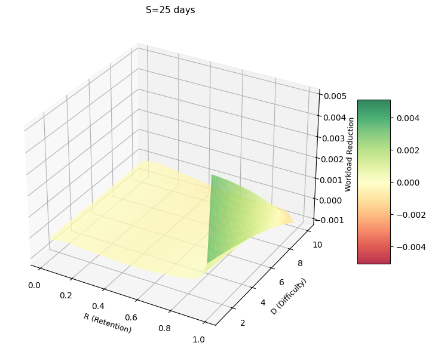
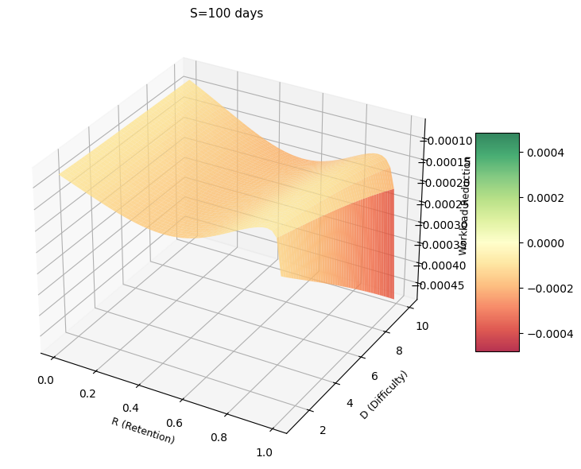
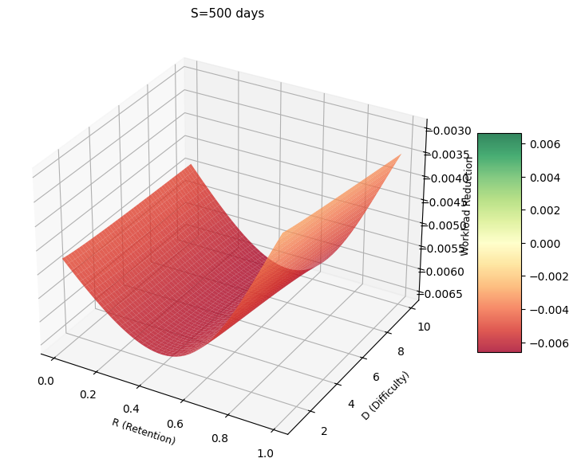
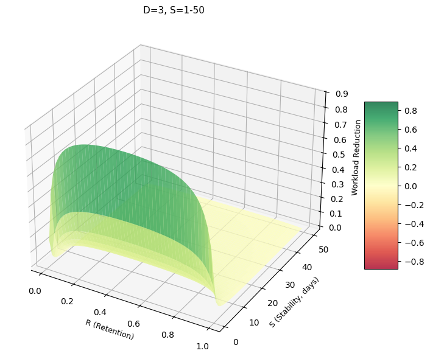
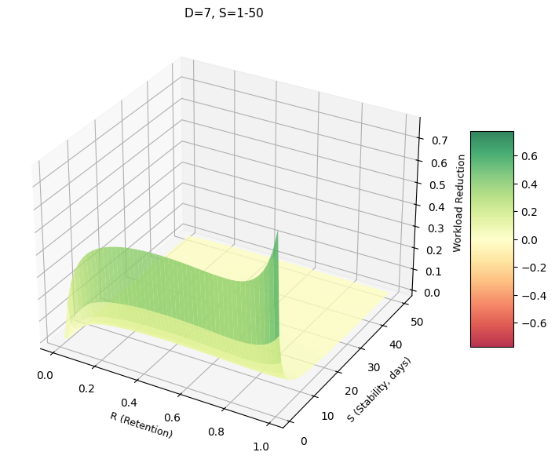
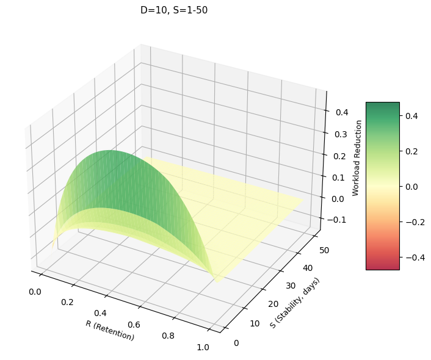
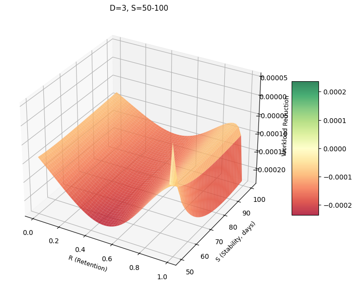
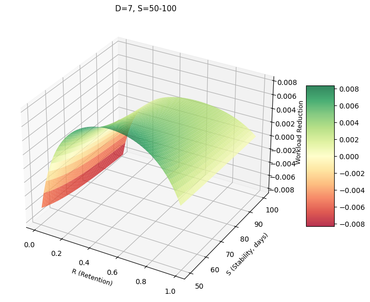

# FSRS-6 Workload Analysis

Analysis tools for understanding workload reduction in the FSRS (Free Spaced Repetition Scheduler) algorithm.

## Scripts

### `workload_analysis.py`
Main analysis script that visualizes workload reduction based on FSRS-6 parameters:
- **Workload reduction** = `workload_init - workload_after`
- Where workload is calculated as `1 / interval_from_retention(R, S)`
- This uses the actual review interval when retention drops to desired level R, rather than raw stability S

Two visualization modes:
1. **By Difficulty**: Varies Difficulty (D) and Retention (R) for fixed Stability (S)
2. **By Stability**: Varies Stability (S) and Retention (R) for fixed Difficulty (D)

### Color Scheme
- **Green**: Workload decreases (beneficial)
- **Red**: Workload increases (detrimental)
- **Yellow**: Minimal change

## Sample Visualizations

### Varying Difficulty at Different Stability Levels
<table>
  <tr>
    <td><br/><center>Short-term cards (S=25 days)</center></td>
    <td><br/><center>Medium-term cards (S=100 days)</center></td>
    <td><br/><center>Long-term cards (S=500 days)</center></td>
  </tr>
</table>

### Varying Stability at Different Difficulty Levels (1-50 days)
<table>
  <tr>
    <td><br/><center>Easy cards (D=3)</center></td>
    <td><br/><center>Medium cards (D=7)</center></td>
    <td><br/><center>Hard cards (D=10)</center></td>
  </tr>
</table>

### Varying Stability at Different Difficulty Levels (50-100 days)
<table>
  <tr>
    <td><br/><center>Easy cards (D=3)</center></td>
    <td><br/><center>Medium cards (D=7)</center></td>
    <td><br/><center>Hard cards (D=10)</center></td>
  </tr>
</table>

## Usage

Generate all sample images:
```bash
python3 -c "from workload_analysis import generate_sample_images; generate_sample_images()"
```

Run interactive analysis:
```bash
python3 workload_analysis.py
```

## Parameters
- **S (Stability)**: Days until retention drops to target level
- **D (Difficulty)**: Card difficulty (1-10)
- **R (Retention)**: Probability of recall at review time (0-1)
